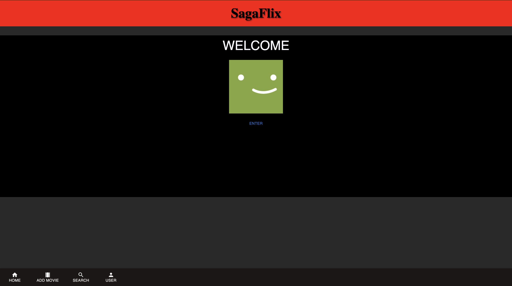
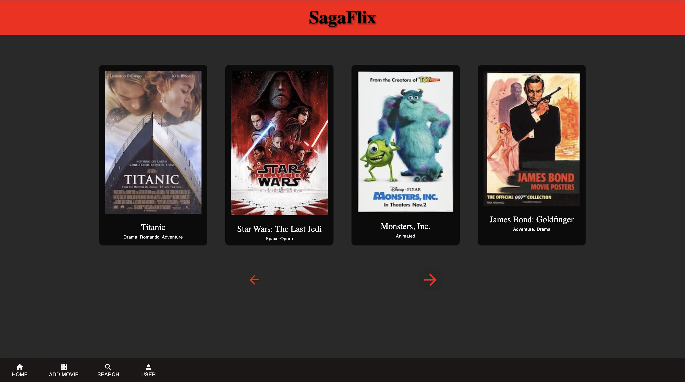
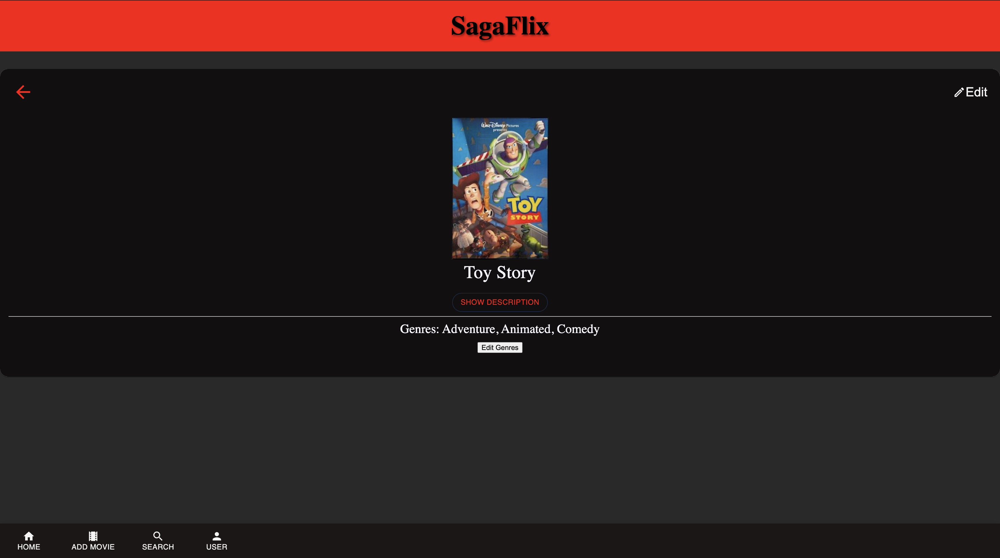

# PROJECT NAME
'Movie-Sagas'

A practice project with focus on:
## React-Redux with Redux-Sagas ##

This project had two separate parts to work on:

1. Adding features to an existing Movie App with React-Redux and Redux-Sagas
2. Practicing SQL

## Description

Movie App, named 'SagaFlix'. Slight clone of the one and only, NetFlix.

For this weekend challenge I expanded on a movie management application, with the following description:

 "We're already able to see movies that exist in our DB. We'll need to be able to see detailed view for each individual movie, including all genres associated with that movie. This is a very common pattern, to go from a list to showing more information about a single item."

I added the ability to view movie details when the image of the movie is clicked, used conditional rendering to display data, and a variety of other methods to practice the techniques I have learned through Emerging Digital Academy's Koss Cohort Tier 2 curriculum. This project has a strong focus on Redux and the use of Sagas.

## Screen Shots

## Installation

1. Create a database named `saga_movies_weekend`,
2. The queries in the `database.sql` file are set up to create all the necessary tables and populate the needed data to allow the application to run correctly. The project is built on [Postgres](https://www.postgresql.org/download/), so you will need to make sure to have that installed. We recommend using Postico to run those queries as that was used to create the queries, 
3. Open up your editor of choice and run an `npm install`
4. Run `npm run server` in your terminal
5. Run `npm run client` in your terminal
6. The `npm run client` command will open up a new browser tab for you!

## Usage
The App is designed to scroll through a list of movies, and display movie details upon click of the movie image.

1. The Welcome screen has one button for now:'enter'. Allows user to enter the App.
2. Use the buttons on the home screen to scroll through the list of movies
3. See a movie you like? Click it to see details about the movie!
4. Navigate to the 'Add Movie' link to add a movie to the database. Make sure to include an image for the poster!
5. The Edit button allows a user to edit the title and description of the movie.

## Built With

### Technology Utilized
 - React
 - Redux
 - Sagas 
 - SQL
 - Postman
 - Postico
 - JavaScript

 ### Styling Frameworks
 - Material UI
 - Font Awesome
 - CSS

## Acknowledgement
Thanks to [Emerging Digital Academy](https://emergingacademy.org) who equipped and helped me to make this application a reality. 

## Support
If you have suggestions or issues, please email me at [tmk1.tran](www.google.com)